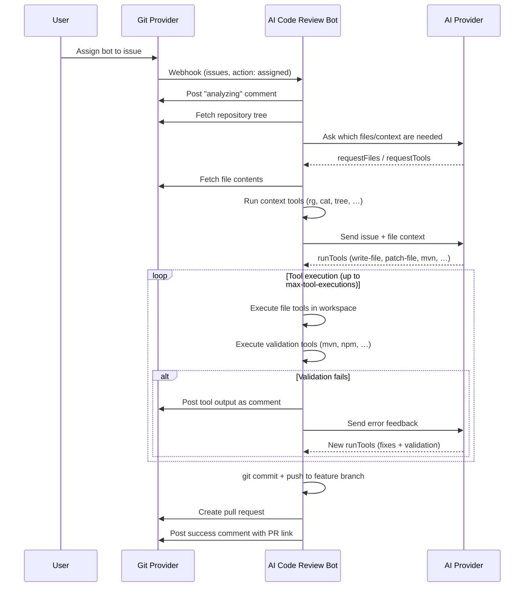

# Issue Implementation Agent
AI-Git-Bot includes an **autonomous issue implementation agent** — the "Agent" half of *"Half Bot, half Agent"*. Assign the bot to an issue in your Git hosting platform (Gitea, GitHub, or GitLab), and it will autonomously analyze the issue description, write the code using file tools inside a cloned workspace, validate the result with build tools, and automatically create a pull request with the proposed changes.
## How It Works

1. A user assigns the bot's user account to an issue
2. The Git provider sends an `issues` webhook with `action: "assigned"`
3. The bot posts a progress comment and fetches the repository file tree
4. The bot asks the AI which files and context it needs (`requestFiles`, `requestTools`)
5. The bot fetches file contents and runs context tools (`cat`, `rg`, `tree`, …) in the cloned workspace
6. The bot sends the issue description and collected context to the AI
7. The AI responds with a `runTools` array containing **file tools** (to write/patch files) and **validation tools** (to build/test)
8. **Tool execution loop**: the bot runs all tools sequentially in the workspace. Validation errors are posted as comments and fed back to the AI for correction (up to `max-retries` times)
9. Once all validation tools pass, the workspace is committed and pushed to a new feature branch
10. The bot creates a pull request and posts a summary comment linking to it
## File Tools
All file modifications are performed through explicit **file tools** inside a cloned workspace. The AI no longer produces diff blocks or JSON file-change arrays — it calls tools just like it calls build tools.
| Tool | Arguments | Description |
|---|---|---|
| `write-file` | `path`, `content` | Create or overwrite a file with the given content |
| `patch-file` | `path`, `search`, `replacement` | Exact string replacement inside a file |
| `mkdir` | `path` | Create a directory (including parents) |
| `delete-file` | `path` | Delete a file |
**File tools are silent** — their results are not posted as public comments on the issue. Only validation tool output (build errors, test failures) is visible to the user.
### Why tool-based, not diff-based?
The previous approach required the AI to produce SEARCH/REPLACE diff blocks in a structured JSON format (`fileChanges`). In practice this was fragile:
- Only premium AI models could reliably produce syntactically valid diffs
- Even small differences between the expected and actual file content (variable names, whitespace) caused diff application to fail
- The AI had to hold the entire JSON diff structure in its working context, burning tokens
With file tools, the AI instead:
1. Uses `cat` in `requestTools` (or a dedicated context-only round) to read the exact current content of a file
2. Uses `patch-file` in a later `runTools` batch with the verbatim text it just read as the search string
3. Or uses `write-file` to replace the whole file when the change is large
This works reliably with **any model tier**.
## Context Tools
Before and during implementation the AI can request read-only repository context:
| Tool | Description |
|---|---|
| `cat` | Read a file (with optional line range) |
| `rg` / `grep` | Search for patterns across files |
| `find` | Find files matching a glob pattern |
| `tree` | Show directory structure |
| `git-log` | Commit history for a file |
| `git-blame` | Per-line authorship |
Context tool results are fed back to the AI but **not posted publicly**.
## Setup
### 1. Agent is Enabled by Default
The agent is **enabled by default**. If you need to disable it, set the following environment variable (or application property):
```bash
export AGENT_ENABLED=false
```
### 2. Configure Webhooks
In addition to the existing webhook events (Pull Request, Issue Comment, etc.), enable the **Issues** event type in your webhook configuration:
**For Gitea:**
- Go to **Settings → Webhooks → Edit**
- Check **Issues** under "Custom Events"
- Save
**For GitHub:**
- Go to **Settings → Webhooks → Edit**
- Under "Which events would you like to trigger this webhook?", ensure **Issues** is checked
- Save

> Note for GitHub issues webhooks: native payloads do not include an issue branch ref.
> To work on a non-default branch, the agent can request a `branch-switcher` tool call
> during context discovery before additional file/tool requests.
> The GitHub payload translator still accepts `issue.ref` when present for non-standard
> translated/custom payloads and forwards it as compatibility metadata.
### 3. Required Permissions
The bot's API token needs **write** access to:
- **Repository**: Create branches, push commits, create pull requests
- **Issues**: Post comments on issues
Ensure the bot user has at minimum **Write** permission on the target repositories.
### 4. Optional Configuration
| Environment Variable | Property | Default | Description |
|---|---|---|---|
| `AGENT_ENABLED` | `agent.enabled` | `true` | Enable/disable the agent feature |
| `AGENT_MAX_TOKENS` | `agent.max-tokens` | `32768` | Maximum tokens for AI responses |
| `AGENT_BRANCH_PREFIX` | `agent.branch-prefix` | `ai-agent/` | Prefix for created branches |
| `AGENT_ALLOWED_REPOS` | `agent.allowed-repos` | *(empty = all)* | Comma-separated list of `owner/repo` where agent is active |
| `AGENT_VALIDATION_ENABLED` | `agent.validation.enabled` | `true` | Enable build/test validation before commit |
| `AGENT_VALIDATION_MAX_RETRIES` | `agent.validation.max-retries` | `3` | Max AI correction attempts on validation failure |
| `AGENT_VALIDATION_MAX_TOOL_EXECUTIONS` | `agent.validation.max-tool-executions` | `10` | Max total tool rounds per session |
| `AGENT_VALIDATION_TOOL_TIMEOUT` | `agent.validation.tool-timeout-seconds` | `300` | Timeout for each tool command |
| `AGENT_VALIDATION_AVAILABLE_TOOLS` | `agent.validation.available-tools` | `mvn,gradle,npm,...` | Comma-separated list of available validation tools |
## AI-Driven Code Generation and Validation
The agent uses AI-driven tool calls where the AI decides which file operations and validation commands to run based on the project structure.
### How It Works
1. The AI analyzes the repository file tree (e.g., sees `pom.xml`) and reads relevant source files via `requestTools` such as `cat`
2. If it needs to inspect a file before patching it, the AI first requests context in a dedicated context step:
   ```json
   {
     "summary": "Inspect HelloService before patching it",
     "requestTools": [
       {"id": "550e8400-e29b-41d4-a716-446655440001", "tool": "cat",
        "args": ["src/main/java/HelloService.java", "1", "40"]}
     ]
   }
   ```
3. After receiving that context, the AI responds with a `runTools` array that mixes file tools and validation tools:
   ```json
   {
     "summary": "Add greeting method to HelloService",
     "runTools": [
       {"id": "550e8400-e29b-41d4-a716-446655440002", "tool": "patch-file",
        "args": ["src/main/java/HelloService.java",
                 "    // end of class\n}",
                 "    public String greet(String name) {\n        return \"Hello, \" + name;\n    }\n\n    // end of class\n}"]},
       {"id": "550e8400-e29b-41d4-a716-446655440003", "tool": "mvn",
        "args": ["test", "-q", "-B"]}
     ]
   }
   ```
3. The bot executes all tools sequentially in the cloned workspace
4. `cat` should not be placed in the same `runTools` batch as a dependent `patch-file`; inspect first, then patch
5. File tool results are silent; validation tool output (`mvn`, `npm`, …) is posted as an issue comment
6. If there are build/test errors, the AI fixes the code and requests the tools again
7. Once all validation tools succeed, the workspace is committed and pushed
### Installed Build Tools
The Docker image includes the following build tools:
| Language | Tools |
|----------|-------|
| **Java** | `mvn` (Maven), `gradle`, OpenJDK 21 |
| **JavaScript/TypeScript** | `npm`, `node` |
| **Python** | `python3`, `pip` |
| **Go** | `go` |
| **Rust** | `cargo`, `rustc` |
| **C/C++** | `gcc`, `g++`, `make`, `cmake` |
| **Ruby** | `ruby`, `bundle` |
### Configuration
You can customize which validation tools are available:
```yaml
agent:
  validation:
    enabled: true
    max-retries: 3
    max-tool-executions: 10
    tool-timeout-seconds: 300
    available-tools:
      - mvn
      - gradle
      - npm
      - go
      - cargo
      - python3
      - make
```
## Dynamic File Requests
Before generating the implementation, the AI can request additional files or run context tools it needs:
```json
{
  "summary": "Need more context before implementing",
  "requestFiles": ["src/main/java/Service.java", "src/main/resources/application.yml"],
  "requestTools": [
    {"id": "550e8400-e29b-41d4-a716-446655440010", "tool": "rg",
     "args": ["UserService", "src/main/java"]}
  ]
}
```
The bot fetches the files and runs the tools, then asks the AI to continue with the collected context. This avoids sending all files upfront and keeps token usage low.
### Example Docker Compose
```yaml
services:
  app:
    image: dakraid/ai-git-bot:latest
    environment:
      GITEA_URL: https://your-gitea-instance.com
      GITEA_TOKEN: your-gitea-api-token
      AI_PROVIDER: anthropic
      AI_ANTHROPIC_API_KEY: your-api-key
      BOT_USERNAME: ai_bot
      AGENT_BRANCH_PREFIX: "ai-agent/"
      # AGENT_ENABLED: "false"  # Uncomment to disable the agent
      # AGENT_ALLOWED_REPOS: "myorg/repo1,myorg/repo2"
```
## Security Considerations
1. **No auto-merge**: The agent creates a pull request but never merges it. A human must review and approve all changes.
2. **Repository whitelist**: Use `agent.allowed-repos` to restrict which repositories the agent can operate on.
3. **Path traversal protection**: File tools reject any path that escapes the workspace root (e.g. `../../etc/passwd`).
4. **Prompt injection protection**: The agent prompt includes guardrails against prompt injection from issue descriptions.
5. **Workspace cleanup**: The temporary clone is always deleted after the session, whether it succeeded or failed.
6. **Feature toggle**: The agent is enabled by default (`agent.enabled=true`). Set `AGENT_ENABLED=false` to disable it if needed.
## Limitations
1. **Context window limits**: Large repositories may exceed the AI provider's context window. The agent limits the number of files sent as context and truncates content when necessary.
2. **Complex multi-file changes**: The agent works best for focused, well-described issues. Very complex issues requiring changes across many files may produce incomplete or incorrect implementations.
3. **Iterative refinement**: The agent auto-corrects errors through iterative AI feedback. After `max-retries` attempts it will create the PR with a warning comment if validation still fails.
4. **No dependency management**: The agent cannot add new project dependencies (e.g., Maven/Gradle dependencies) — it can write code but cannot modify `pom.xml` to add new library entries automatically and expect them to resolve.
5. **Ollama/Local LLM support**: The agent requires models that reliably follow structured JSON output. Most small local LLMs are **not recommended** — they often fail to produce valid tool-call JSON. Use Anthropic Claude or OpenAI GPT-4 for best results. See [Ollama Limitations](#ollama-limitations) below.
## Ollama Limitations
⚠️ **The agent feature has limited support with Ollama and other local LLMs.**
The agent requires the AI to respond with a specific JSON format containing `runTools` entries (file tools + validation tools).
### Automatic JSON Mode
The bot **automatically enables Ollama's JSON mode** when the agent is used. This forces the model to output valid JSON and significantly improves reliability. You can verify this in the logs:
```
INFO: Ollama chat request: JSON mode enabled for structured output
```
However, even with JSON mode enabled, local models may:
- Produce incomplete or malformed JSON for complex requests
- Struggle with multi-file implementations
- Forget to use `cat` before `patch-file` and produce incorrect search strings
**Recommendations:**
| Use Case | Recommended Provider |
|----------|---------------------|
| **Agent (issue implementation)** | Anthropic Claude or OpenAI GPT-4 (most reliable) |
| **Agent with local LLM** | Ollama with 32B+ parameter models |
| **Code reviews (PR comments)** | Any provider, including small Ollama models |
### Using Larger Models with Ollama
Larger models (32B+ parameters) have significantly better instruction-following capabilities and **may work** with the agent:
| Model | Agent Compatibility | RAM Required |
|-------|---------------------|--------------|
| `qwen2.5-coder:32b` | ✅ Best chance | ~24 GB+ |
| `deepseek-coder:33b` | ✅ Best chance | ~24 GB+ |
| `codellama:70b` | ✅ Best chance | ~48 GB+ |
| `deepseek-coder-v2:16b` | ⚠️ May work | ~12 GB+ |
**Important:** Even these larger models may occasionally fail. For reliable production use, cloud-based providers (Anthropic, OpenAI) are recommended.
To try the agent with a larger Ollama model:
```bash
ollama pull qwen2.5-coder:32b
export AI_PROVIDER=ollama
export AI_MODEL=qwen2.5-coder:32b
export AGENT_ENABLED=true
```
To **disable the agent** when using smaller Ollama models (recommended):
```bash
export AGENT_ENABLED=false
```
## Error Handling
- If the agent fails at any point during implementation, it posts a failure comment on the issue with the error message and cleans up the workspace
- If the AI response cannot be parsed, the agent retries with feedback about the expected format
- If a `patch-file` call fails because the search text is not found, the error is returned to the AI so it can re-read the file and try again
## Branch Naming
Branches created by the agent follow the pattern:
```
{branch-prefix}issue-{issue-number}
```
For example: `ai-agent/issue-42`
